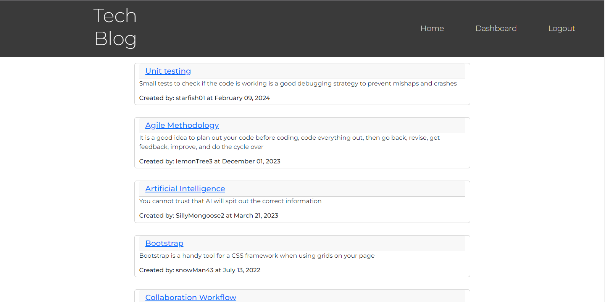
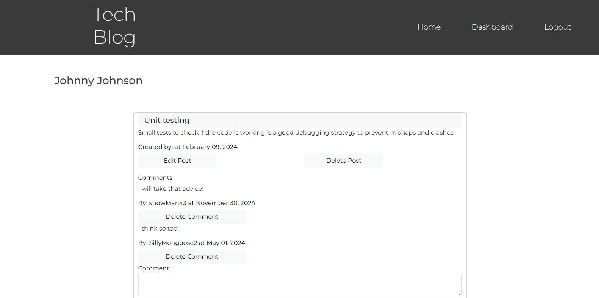
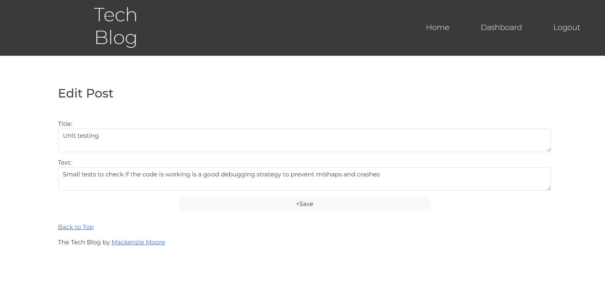
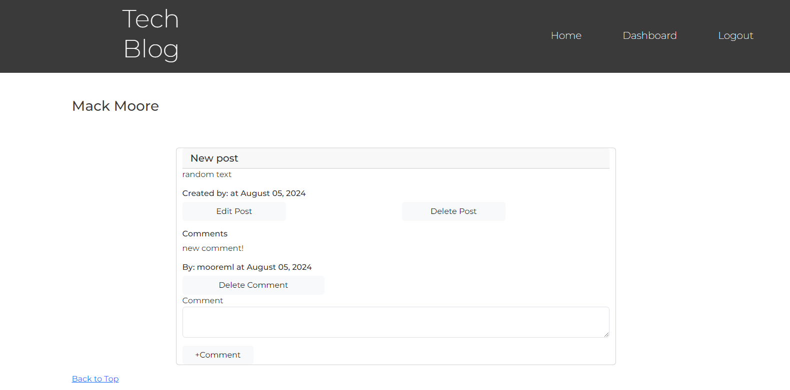

# 12-tech-blog

  

## Description
The fourteenth challenge assignment from a bootcamp where the task was to build, from scratch, a CMS-style blog site, where developers can publish their blog posts and comment on other developers' posts as well. This application follows the MVC paradigm, utilizes Handlebars.js, Sequelize and express-session for authentication.

## Table of Content
-[Description](#Description)
-[Process](#Process)
-[Links](#Links)
-[Installation](#Installation)
-[Usage](#Usage)
-[Licenses](#Licenses)
-[Contribution](#Contribution)
-[Test](#Test)
-[Acknowledgement](#Acknowledgement)
-[Questions](#Questions)

## Process
The process included creating a schema and User, Post, and Comment models. The Post and Comment models included date timestamps and the dates were formatted with a helper from util folder. All of the models were seeded with data from the seeds folder. The server routes were created from scratch for CRUD operations on users, comments, and posts. An authentication helper in the utils folder was incorporated into some of the routes to ensure user is logged in before hitting certain routes. The home-routes.js file rendered all of the pages of the application. The pages were created initially with html then transferred to handlebar syntax. Front-end js files fetched each of the routes when called upon to perform the operations when necessary. A connection file incorporated Sequelize for the database and server.js linked express, sequelize, and handlebars together.

## Links
Link to site: https://one2-tech-blog.onrender.com/

## Installation
To install this application, copy the ssh key from my github repo and clone it into your respository. Do an npm install. Run the schema file as well as the command 'npm run seed' to seed the database. Then, 'npm start', to start the server.

## Usage
This site was a practice assignment for bootcamp students but can be used to see how an application made by MongoDB works. 

## Licenses
This repository is using the [MIT](https://opensource.org/licenses/MIT) license.

## Contribution
Contact me by email provided in Questions section.

## Test
To test this application, simply open the applcation in VScode and Insomnia to try it out.

## Acknowledgement
Project was done by the knowledge learned from bootcamp instructor John.

## Questions
Contact with questions at:

Email: mackenzielmoore14@gmail.com
Click [here](https://github.com/mackemo) for Github account.